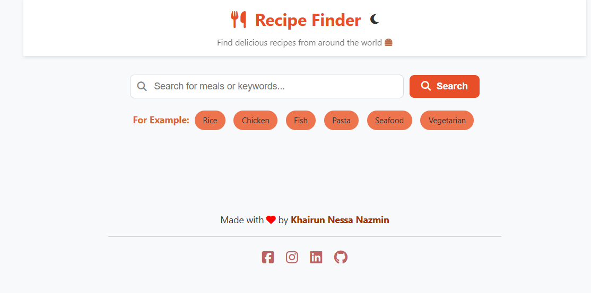
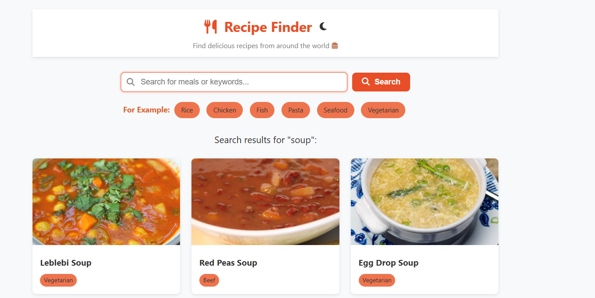

# Your Goto Recipe Finder

Find recipes by just using the main ingredient name.

A simple and modern web app to search for delicious recipes from around the world. Powered by [TheMealDB API](https://www.themealdb.com/api.php).

## Features

- 🔍 **Search Recipes:** Find meals by name or keyword.
- 🍽️ **Popular Categories:** Quick access to popular meal categories.
- 📋 **Recipe Details:** View ingredients, instructions, and images for each recipe.
- 🌗 **Theme Toggle:** Switch between light and dark mode.
- ⚡ **Responsive Design:** Works great on desktop and mobile.

## Getting Started

1. **Clone the repository:**
   ```sh
   git clone https://github.com/your-username/your-goto-recipe-finder.git
   ```
2. **Open `index.html` in your browser.**

No build steps or dependencies required!

## Credits

- Data powered by [TheMealDB](https://www.themealdb.com/api.php)
- Icons by [Font Awesome](https://fontawesome.com/)

## Preview



## PPT
[text](Recipe Finder.pptx)

## Author

[Khairun Nessa Nazmin](https://www.linkedin.com/in/khairun-nessa-nazmin-39114424b/)

---

*Enjoy discovering new recipes!*